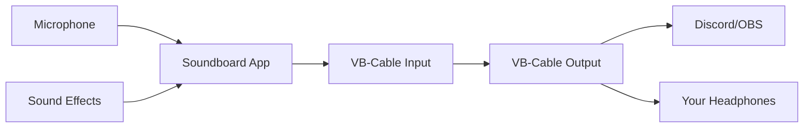

  <h1>🎵 Soundboard Application</h1>
  

    <strong>A professional Windows soundboard application for streamers, content creators, and gamers</strong>
  

  

    <a href="#features">Features</a> •
    <a href="#prerequisites">Prerequisites</a> •
    <a href="#quick-start">Quick Start</a> •
    <a href="#usage">Usage</a> •
    <a href="#troubleshooting">Troubleshooting</a> •
    <a href="#contributing">Contributing</a>
  

  

    
    
    
  

A modern Windows C# WPF soundboard application that mixes microphone audio with sound effects and outputs to a virtual audio cable for use with applications like Discord, OBS, or any other voice chat software.

## ✨ Features

- 🎙️ **Real-time Audio Mixing**: Seamlessly combines microphone input with sound effects
- 🎛️ **Virtual Audio Cable Support**: Outputs mixed audio to VB-Cable for use with Discord, OBS, and more
- 🎨 **Modern Dark UI**: Sleek, dark-themed WPF interface with smooth animations and hover effects
- 🎵 **Wide Format Support**: Plays WAV, MP3, M4A, WMA, and AAC audio files
- ⌨️ **Keyboard Shortcuts**: Quick access to sounds with F1-F12 keys (F5 refresh the output devices)
- 🎧 **Monitor Controls**: Option to hear your microphone locally
- 📊 **Audio Visualization**: Real-time microphone level indicator
- 🎚️ **Audio Device Selection**: Flexible routing for different output devices

## 🚀 Quick Start

### Prerequisites

#### Required Software
- **Windows 10/11** (64-bit recommended)
- **VB-Cable (Virtual Audio Cable)** - [Download here](https://vb-audio.com/Cable/)
- **.NET 6.0 Runtime** - [Download here](https://dotnet.microsoft.com/en-us/download/dotnet/6.0) (if not building from source)

#### VB-Cable Installation
1. Download VB-Cable from the [official website](https://vb-audio.com/Cable/)
2. Extract the downloaded ZIP file
3. Right-click on `VBCABLE_Setup_x64.exe` (or x86 for 32-bit systems) and select "Run as administrator"
4. Follow the installation wizard
5. **Important**: Restart your computer after installation

## 🎛️ Setup Instructions

### Discord Configuration
1. Open Discord and go to **User Settings** → **Voice & Video**
2. Set **Input Device** to: `CABLE Output (VB-Audio Virtual Cable)`
3. Set **Output Device** to your preferred playback device

### Soundboard Configuration
1. Launch the Soundboard Application
2. Set **Output Device** to: `CABLE Input (VB-Audio Virtual Cable)`
3. (Optional) Check "Monitor microphone locally" to hear yourself
4. Click **Start Monitoring** to begin

## 🎮 Usage

1. **Load Sounds**
   - Click "Browse" to select a folder containing your sound files
   - Supported formats: WAV, MP3, M4A, WMA, AAC

2. **Play Sounds**
   - Click any sound button to play
   - Use F1-F12 keys for quick access to the first 12 sounds
   - Press ESC to stop all playing sounds

3. **Audio Monitoring**
   - The microphone level meter shows your input volume
   - Adjust your microphone gain if needed
   - Toggle "Monitor microphone locally" to hear your own voice

## 🛠 How It Works

1. **Audio Capture**: Microphone input is captured by the application
2. **Mixing Engine**: Sound effects are mixed with microphone input in real-time
3. **Virtual Routing**: Mixed audio is sent to VB-Cable Input
4. **Application Output**: Discord/OBS receives the final mixed audio from VB-Cable Output

## 🎯 Pro Tips

- **Hotkey Mapping**: Map frequently used sounds to F1-F12 for quick access (F5 refresh the output devices)
- **Sound Organization**: Keep your sound files well-organized in separate folders for different categories
- **Volume Levels**: Adjust individual sound volumes before adding them to ensure consistent output levels
- **Naming Convention**: Use clear, descriptive names for your sound files for easy identification

## 🎛️ Supported Audio Formats

| Format | Description |
|--------|-------------|
| WAV    | Uncompressed audio format |
| MP3    | Popular compressed audio format |
| M4A    | MPEG-4 Audio (AAC) |
| WMA    | Windows Media Audio |
| AAC    | Advanced Audio Coding |

## ⌨️ Keyboard Shortcuts

| Shortcut | Action |
|----------|--------|
| F1-F12   | Play sound in corresponding button position |
| ESC      | Stop all playing sounds |
| F5       | F5 refresh the output devices |

## 🚨 Troubleshooting

### Common Issues

#### "Failed to start microphone monitoring"
- ✅ **Solution 1**: Restart your computer after installing VB-Cable
- ✅ **Solution 2**: Run the application as administrator
- ✅ **Solution 3**: Check microphone privacy settings in Windows

#### No Sound in Discord
- 🔍 **Check**: Discord input device settings
- 🔄 **Fix**: Ensure output device is set to VB-Cable Input in the soundboard app
- 🔊 **Test**: Play a system sound to verify audio output

#### Can't Hear Sound Effects
- 🎧 **Check**: "Monitor microphone locally" setting
- 🔉 **Verify**: System volume and application volume levels
- 🔌 **Test**: Try different audio output devices

#### VB-Cable Not Detected
- Restart your computer after VB-Cable installation
- Reinstall VB-Cable as administrator
- Check Windows Device Manager for any driver issues

## Building from Source

### Requirements
- Visual Studio 2022 or later
- .NET 6.0 SDK
- Windows 10/11

### Dependencies
- NAudio (for audio processing)
- NAudio.Wasapi (for Windows audio API)
- System.Windows.Forms (for folder dialog)

### Build Steps
1. Clone or download the source code
2. Open `SoundboardApp.sln` in Visual Studio
3. Restore NuGet packages
4. Build the solution (Ctrl+Shift+B)
5. Run the application (F5)

## License

This project is provided as-is for educational and personal use.

## 🤝 Contributing

Contributions are welcome! Please feel free to submit a Pull Request.

1. Fork the repository
2. Create your feature branch (`git checkout -b feature/AmazingFeature`)
3. Commit your changes (`git commit -m 'Add some AmazingFeature'`)
4. Push to the branch (`git push origin feature/AmazingFeature`)
5. Open a Pull Request

## 📄 License

This project is licensed under the MIT License - see the [LICENSE](LICENSE) file for details.

## 🙏 Credits

- **NAudio**: Audio processing library by Mark Heath
- **VB-Cable**: Virtual audio cable by VB-Audio Software

## 📧 Contact

For support or feature requests, please open an issue on GitHub.

---

  Made with ❤️ for my brother Amine

